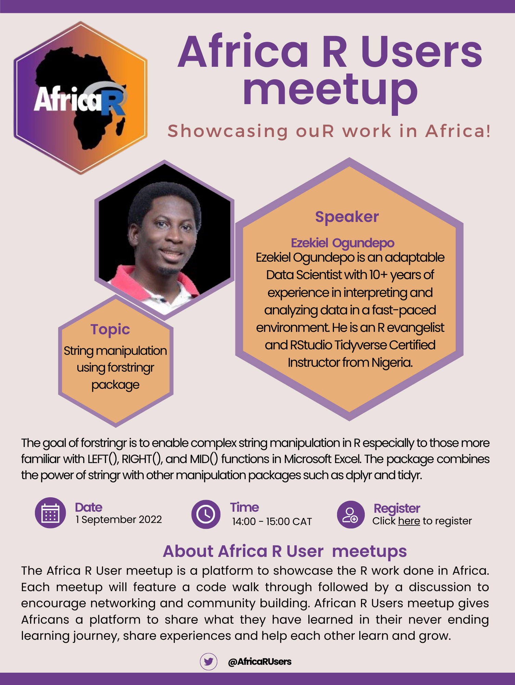

### Date: 1 September 2022

### Time: 14:00 - 15:00 Central African Time (CAT) - [check your local time](https://arewemeetingyet.com/Johannesburg/2022-09-01/14:00/Africa%20R%20User%20Community%20meetup%20-%20Sept%202022#eyJ1cmwiOiJodHRwczovL2V2ZW50cy56b29tLnVzL2V2L0FvUi1DekhHb3ZmTWRodGY1dHN4SEdRZkowY2ZCRXhGN0YzenNWaXJqNmVPMlNSd0l3RUx+QWdnTFhzcjMyUVlGanE4QmxZTFo1STA2RGc/bG10PTE2NjA5MDY1MjIwMDAifQ==)

### Topic: String manipulation using forstringr package

The goal of forstringr is to enable complex string manipulation in R especially to those more familiar with LEFT(), RIGHT(), and MID() functions in Microsoft Excel. The package combines the power of stringr with other manipulation packages such as dplyr and tidyr.

### Speaker: Ezekiel  Ogundepo

Ezekiel Ogundepo is an adaptable Data Scientist with 10+ years of experience in interpreting and analyzing data in a fast-paced environment. He is the first RStudio Tidyverse Certified Instructor from Nigeria.

### About Africa R User meetups

The Africa R User meetup is a platform to showcase the R work done in Africa. Each meetup will feature a code walk through followed by a discussion to encourage networking and community building. African R Users meetup gives Africans a platform to share what they have learned in their never ending learning journey, share experiences and help each other learn and grow. 

---

*This event is proudly organised by Talarify.*
 
*Read more about our work at https://talarify.co.za/*

