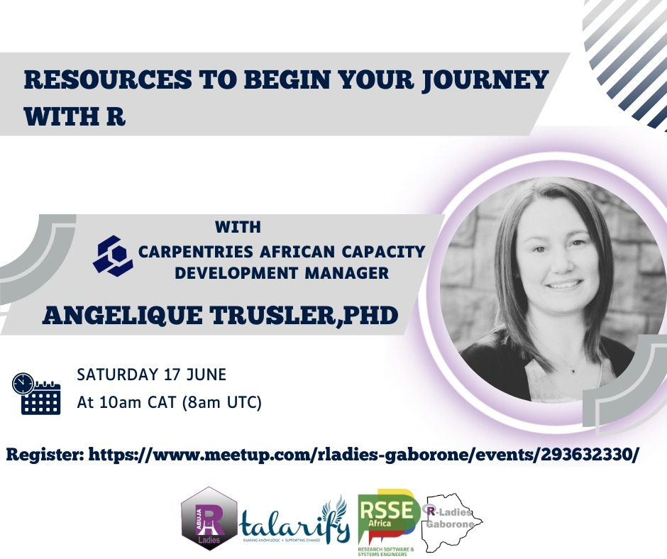

### Date: 27 June 2023

### Time: 10:00 - 11:30 Central African Time (CAT) - [check your local time and add to your calendar](https://arewemeetingyet.com/Johannesburg/2023-06-27/10:00/Resources%20to%20begin%20your%20journey%20with%20R#eyJ1cmwiOiJodHRwczovL3d3dy5tZWV0dXAuY29tL3JsYWRpZXMtZ2Fib3JvbmUvZXZlbnRzLzI5MzYzMjMzMCJ9)

### Details

The Carpentries teaches foundational coding and data science skills to researchers worldwide. All our lessons are available under a Creative Commons license, so anyone is welcome to use them as they wish, provided they attribute them back to us. Our curricula range from data organisation with spreadsheets and data cleaning with OpenRefine to some analyses and plotting with R or Python. We have lessons for more advanced users focussing on visualization in R, working with core data structures, using conditionals and loops, writing custom functions and running R programs. Join this session to explore our various resources to begin your journey with R.

### Speaker: Dr Angelique Trusler

Angelique, PhD (Educational Psychology), is the African Capacity Development Manager at The Carpentries and an Extraordinary Researcher at Optentia Research Unit, North-West University, Vaal Triangle Campus. The Carpentries teaches foundational coding and data science skills to researchers worldwide. Angelique aims at developing strategies and workflows to adapt The Carpentries' membership and workshop programs to function optimally in Southern Africa. In addition, her role aims to assist and advise in developing a plan to create and support a strong team of volunteer instructors across Africa.

### About the organisers

This event is organised by [R-Ladies Gaborone](https://www.meetup.com/rladies-gaborone/) with support from [R-Ladies Abuja](https://www.meetup.com/rladies-abuja/), [R-Ladies Rabat](https://www.meetup.com/rladies-rabat-ma/events/), [Talarify](https://talarify.co.za) and [RSSE Africa](https://rsse.africa).

