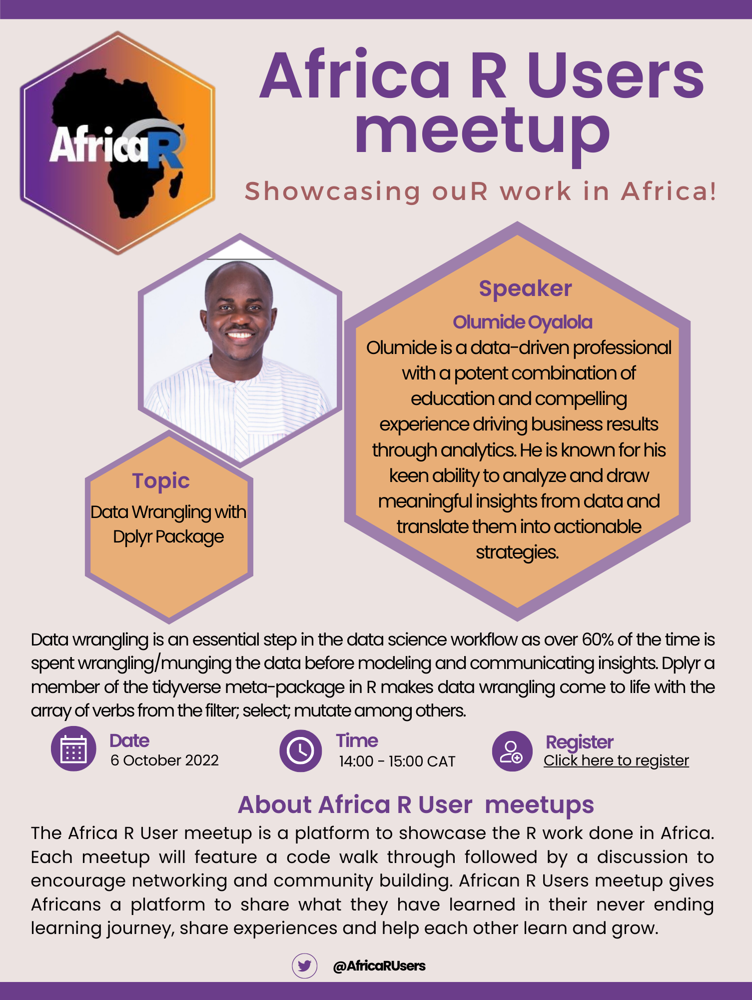

### Date: 6 October 2022

### Time: 14:00 - 15:00 Central African Time (CAT) - [check your local time](https://arewemeetingyet.com/Johannesburg/2022-10-06/14:00/Africa%20R%20User%20Community%20meetup%20-%20Oct%202022)

### Topic: Data Wrangling with Dplyr Package

Data wrangling is an essential step in the data science workflow as over 60% of the time is spent wrangling/munging the data before modeling and communicating insights. Dplyr a member of the tidyverse meta-package in R makes data wrangling come to life with the array of verbs from the filter; select; mutate among others. I will share a workflow of how I used these verbs for data wrangling on a transport analytics project.

### Speaker: Olumide Oyalola

Olumide is a data-driven professional with a potent combination of education and compelling experience driving business results through analytics. He is known for his keen ability to analyze and draw meaningful insights from data and translate them into actionable strategies. He possess excellent research, teaching, listening, and interpersonal skills. He particularly enjoys the process of contributing to the learning journey of data analysts that are just starting. He makes time for freelance projects that are engaging and challenging!

### About Africa R User meetups

The Africa R User meetup is a platform to showcase the R work done in Africa. Each meetup will feature a code walk through followed by a discussion to encourage networking and community building. African R Users meetup gives Africans a platform to share what they have learned in their never ending learning journey, share experiences and help each other learn and grow. 

---

*This event is proudly organised by Talarify.*
 
*Read more about our work at https://talarify.co.za/*

